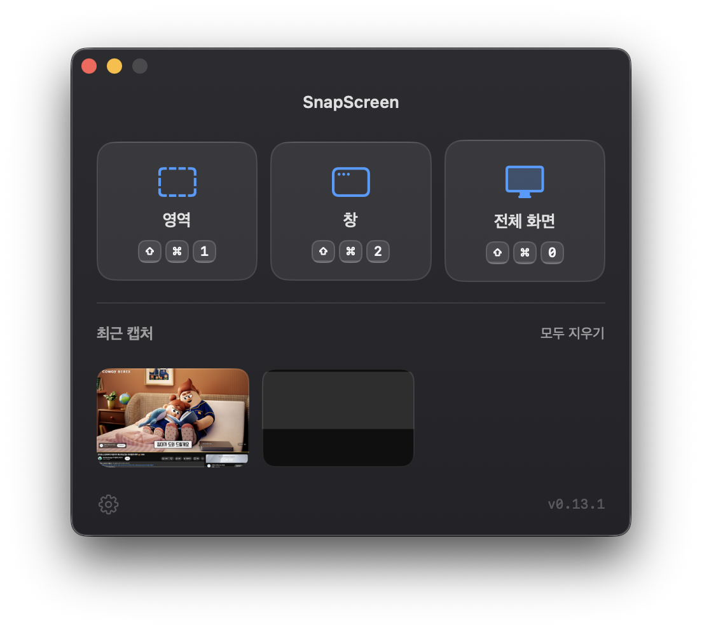
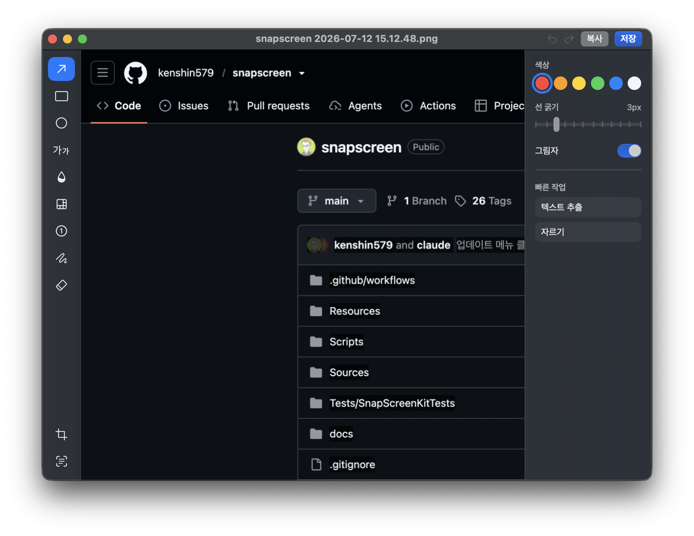
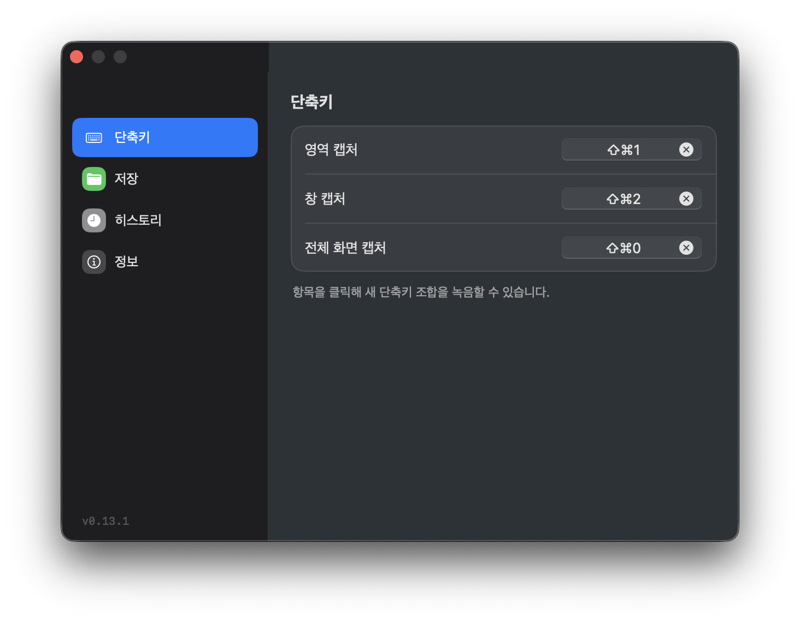

# SnapScreen

> SnapScreen — free, open-source screenshot capture & annotation tool for macOS.

A screenshot capture and annotation tool for macOS. It is open source. When launched, a Home window with capture buttons opens and a Dock icon appears. When all windows are closed, the Dock icon disappears and the app lives in the menu bar.

## Features

- **Home window**: Opens automatically on launch, letting you click the region / window / full-screen capture buttons directly (shortcuts are shown too).
- **Recent captures gallery**: Reopen captures — even unsaved ones — from the Home window (last 50), browsed horizontally in a single row; when it's scrollable, left/right arrows also let you page through them.
- **Capture**: Global shortcuts for region (`⌘⇧1`), window (`⌘⇧2`), and full-screen (`⌘⇧0`) capture.
- **Annotation editor**: Arrow · rectangle · ellipse · text · blur · mosaic · number badge · pen (freehand) · eraser (partially erase freehand strokes / delete annotations), with per-tool shortcuts (`A`/`R`/`O`/`T`/`G`/`B`/`N`/`P`/`X`).
- **Crop**: Drag to crop a region of the image (`C`, only when there are no annotations) — the image is replaced in the same window and the window resizes to the new aspect ratio.
- **OCR (text extraction)**: Recognizes text in the image and copies it to the clipboard (`E`).
- **Undo / Redo**: `⌘Z` / `⇧⌘Z`.
- **Export**: Copy to clipboard (`⌘C`), save to file (`⌘S`) — an in-editor toast confirms the result right after a copy or extraction.
- **Save-location sync**: Automatically follows the macOS system screenshot save location (`screencapture` setting).
- **Settings window**: Customize shortcuts, save folder, and filename prefix.
- **Dedicated app icon**: A violet-gradient icon with a capture-stack motif (Finder/Dock/⌘Tab).

> Use **mosaic** to hide sensitive information — weak blur can be reversed.

## Screenshots

All screenshots below were captured with SnapScreen itself.

### Home window

Region / window / full-screen capture buttons and the recent captures gallery:



### Annotation editor

Tool rail on the left, canvas in the middle, and the color / line-width / quick-actions inspector on the right:



### Settings

Customize capture shortcuts, save folder, and history:



## Requirements

- macOS 14 (Sonoma) or later

## Installation

1. Download the latest zip from [GitHub Releases](https://github.com/kenshin579/snapscreen/releases).
2. Unzip it and move `SnapScreen.app` into your `Applications` folder.
3. This app is an unsigned distribution, so before running it for the first time you must remove the quarantine attribute from the Terminal:

   ```bash
   xattr -cr /Applications/SnapScreen.app
   ```

4. Then launch `SnapScreen.app`. On launch, a Home window with capture buttons opens; when you close it, the app stays in the menu bar.

### Screen Recording Permission

Screen Recording permission is required the first time you attempt a capture.

1. Go to **System Settings > Privacy & Security > Screen & System Audio Recording**.
2. Turn on **SnapScreen** in the list.
3. Restart the SnapScreen app.

## Build from Source

Requirements: Xcode Command Line Tools

```bash
Scripts/run.sh
```

Run tests:

```bash
swift test
```

## Default Shortcuts

| Action | Shortcut |
| --- | --- |
| Region capture | `⌘⇧1` |
| Window capture | `⌘⇧2` |
| Full-screen capture | `⌘⇧0` |
| Arrow tool | `A` |
| Rectangle tool | `R` |
| Ellipse tool | `O` |
| Text tool | `T` |
| Blur tool | `G` |
| Mosaic tool | `B` |
| Number badge tool | `N` |
| Pen tool | `P` |
| Eraser | `X` |
| Crop | `C` |
| Extract text | `E` |
| Undo | `⌘Z` |
| Redo | `⇧⌘Z` |
| Copy to clipboard | `⌘C` |
| Save to file | `⌘S` |

Capture shortcuts can be changed in the Settings window.

## License

[MIT](LICENSE)
